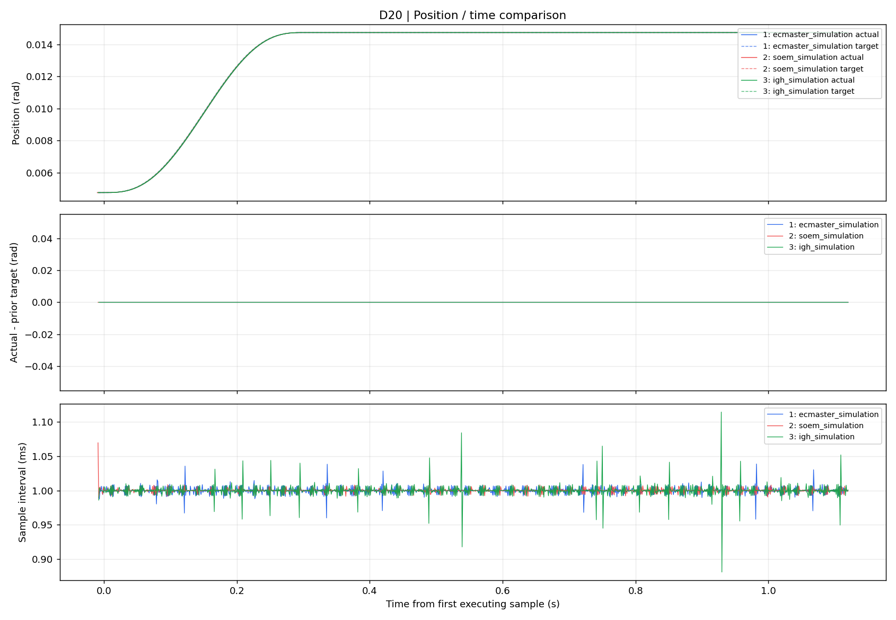

# 三种 EtherCAT 主站：电机位置与抖动对比 (Motor Jitter Viewer)

<p align="left">
  
  
  
  <a href="https://zhuzq2020.github.io"></a>
  <a href="https://huggingface.co/datasets/zaki2022/ethercat-master-jitter-logs"></a>
</p>

> 跨主站（EC-Master / SOEM / IgH）电机位置跟踪曲线与 EtherCAT 通信周期抖动多维度对比分析与可视化工具。

<p align="center">
  
</p>

---

Windows 启动：双击 `start_viewer.cmd`，或在项目目录运行：

```powershell
python jitter_viewer.py
```

当前电脑已有 Python、NumPy、Pandas、Matplotlib、Tkinter。其他电脑可用 `python -m pip install -r requirements.txt` 安装数值与绘图库；GUI 还需要 Python 的 Tkinter。

## 取得日志

三版主站已增加默认开启的周期日志。**需要重启新编译的主站进程才会生效**；此前正在运行的旧进程不会自动获得日志功能。

服务器目录：

- 商用：`/home/admin1/workspace/whole_robot_control_cpp_sdk/logs/runtime/cycle_ecmaster_*.csv`
- SOEM：`/home/admin1/workspace/whole_robot_control_cpp_sdk_soem/logs/runtime/cycle_soem_*.csv`
- IgH：`/home/admin1/workspace/whole_robot_control_cpp_sdk_igh/logs/runtime/cycle_igh_*.csv`

主站可指定 `--cycle-log /完整路径/本次测试.csv`，或 `--no-cycle-log` 关闭记录。默认记录整个主站会话；完成测试后正常停止主站，使缓冲区落盘。日志中包含初始化后空闲、运动、保持、故障等阶段，可用时间范围和命令 ID 筛选。

每次执行 `sudo ./scripts/start.sh` 时，终端会打印：

```text
Cycle log to copy: /home/admin1/workspace/.../logs/runtime/cycle_<backend>_<时间>.csv
```

运行完 `fixed_end_comparison_demo` 后先执行 `sudo ./scripts/stop.sh`，然后只复制该行指出的 CSV。分别放到本工具的 `imported_logs/ecmaster/`、`imported_logs/soem/`、`imported_logs/igh/`。不要复制 `feedback.csv` 代替 1 kHz 周期日志，也不要在主站仍运行时复制尚未完整落盘的文件。

`imported_logs/` 中的实机日志可能很大并包含现场数据，因此默认不提交到 Git。仓库中的 `examples/` 提供可直接使用的仿真样例。

本项目对应的三份实机对比日志发布在 Hugging Face Dataset：

- [zaki2022/ethercat-master-jitter-logs](https://huggingface.co/datasets/zaki2022/ethercat-master-jitter-logs)

可用 Hugging Face CLI 下载（需要先安装 `huggingface_hub`，公开数据集无需登录）：

```powershell
hf download zaki2022/ethercat-master-jitter-logs --repo-type dataset --local-dir hf_logs
Copy-Item hf_logs/raw/ecmaster/*.csv imported_logs/ecmaster/
Copy-Item hf_logs/raw/soem/*.csv imported_logs/soem/
Copy-Item hf_logs/raw/igh/*.csv imported_logs/igh/
```

也可在数据集网页中逐个下载 `raw/<主站>/cycle_*.csv`，并放入本项目相同的 `imported_logs/<主站>/` 目录。随后启动查看器，它会自动选择各目录中最新的日志。

## 看图

1. 双击 `start_viewer.cmd` 后，程序自动选择 `imported_logs/ecmaster/`、`soem/`、`igh/` 中各自修改时间最新的一份 `cycle_*.csv`。需要查看其他批次时再点“导入日志（多选）”。
2. 选择关节 D18–D24；默认 D20。
3. 默认将每份日志的首个 `executing` 样本对齐到 t=0。日志里有多次测试时，先选择对应的命令 ID 或时间范围；不同日志的命令 ID 未必相同，需核对实际测试顺序。
4. 顶图：实际位置与本周期准备的目标位置，横轴秒、纵轴弧度。
5. 中图：实际位置减去上一周期的控制器目标位置。
6. 底图：相邻采样时间间隔；1 ms 周期理想值约为 1 ms。
7. 用工具栏缩放/平移；静止小范围观察可勾选“位置去均值放大”。“导出图和指标”保存 PNG 和指标 CSV。

绘图对大数据采用分桶保留极值，避免简单抽点漏掉尖峰；指标始终基于完整选中数据计算。

## 怎么判断抖动

- **静止保持**：在同一姿态、相同负载下，查看位置的细小往复变化及 RMS/峰峰值。
- **运动中**：对比位置曲线和目标曲线、位置偏差，不把正常轨迹变化的整体幅度当成抖动。
- **调度方面**：查看采样间隔的均值、P99、最大值，以及日志丢弃数和周期缺号；它们反映主机控制回调时间/日志完整性，不等同于网线上报文或驱动内部伺服周期的抖动。

静止指标只选择：CSP 模式 8、驱动已使能、通信健康、无驱动故障、目标保持不变的连续段；每段排除前 250 ms，并至少保留 20 个样本。先对每个保持段的位置误差去均值，再统计 RMS/峰峰值。若显示“无合格静止段”，应选取足够长的已使能保持记录，不用未使能的噪声冒充保持性能。

`target_rad` 是本次控制回调准备的目标；`previous_target_rad` 是上一回调准备的目标，首行未知时为 NaN。它们不是驱动返回的目标回显，故障时底层可能覆盖为安全输出。实际位置与目标之间还包含总线和驱动的响应延迟，因此偏差不全是机械抖动。

约 1 kHz 的日志只能观察采样带宽内的变化，编码器量化、传感器噪声和机械运动都可能影响结果。没有一个通用阈值可以只凭图判定“哪种主站一定更好”；应在相同驱动参数、周期、轨迹、初始姿态和负载下比较多次实机数据。

兼容已有 demo 的 `feedback.csv`（约 50 Hz IPC 快照），可画位置图，但缺少逐周期目标，不能提供同等跟随误差或 1 kHz 调度分析。

## 无界面导出

```powershell
python jitter_viewer.py commercial.csv soem.csv igh.csv --axis 20 --start 10 --end 15 --save comparison.png
```

可加 `--no-align` 保留每份日志相对起点，`--command 3` 筛选命令，`--centered` 对位置去均值。

`examples/` 中的 CSV 和 `three_master_simulation.png` 是**三种主站程序使用同一个仿真运行时产生的验证示例**，用于测试记录/绘图链路，不代表三种实际 EtherCAT 主站的性能。

## 实机对比报告与文档

- 📊 [D22 三种 EtherCAT 主站位置与周期抖动对比完整分析报告](three_master_jitter_comparison.md)：包含完整轨迹、周期局部放大、指标图和分析建议。
- 📖 [EtherCAT 与 CANopen/CiA 402 伺服控制入门：从 CoE、SDO/PDO 到状态机](https://zhuzq2020.github.io/2026/07/22/EtherCAT-CANopen-CiA402-Servo-Control/)：作者技术博客专栏文章，深度解析总线原理。

## 📄 开源许可证

本项目基于 [MIT License](LICENSE) 协议开源。
