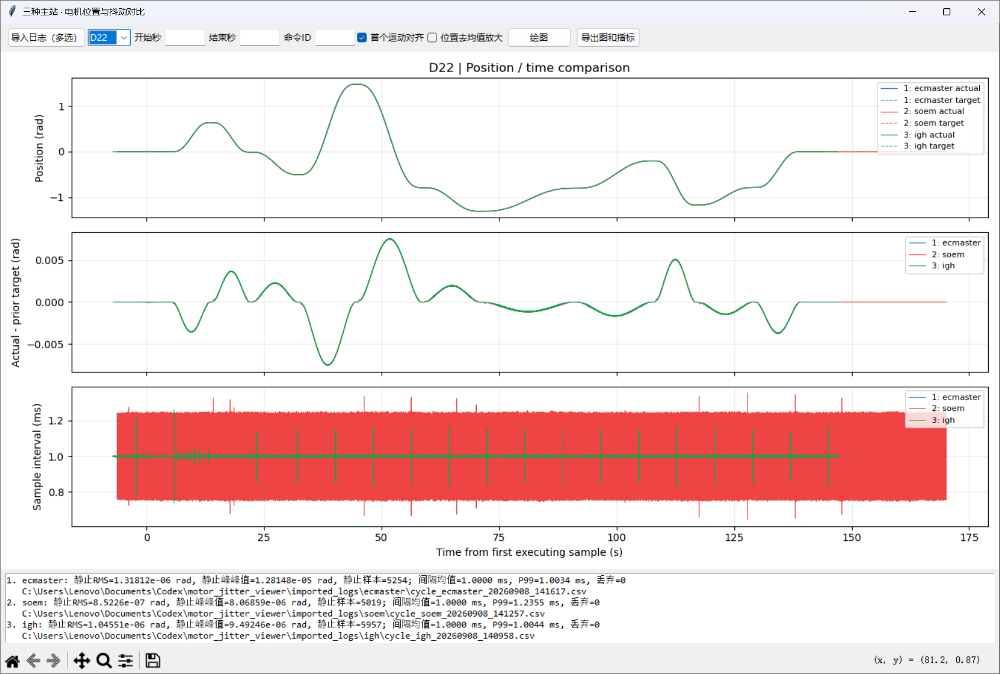
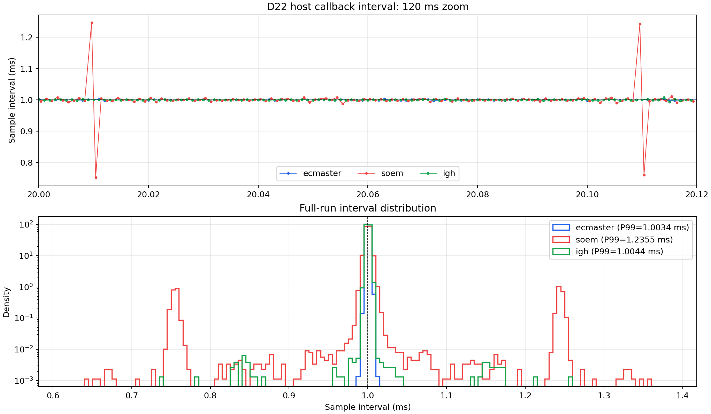
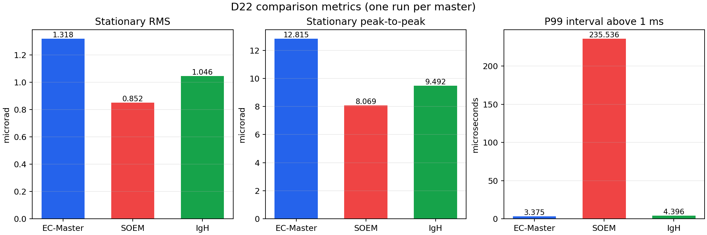

# D22 三种 EtherCAT 主站位置与周期抖动对比

## 1. 数据范围

本报告对比同一套固定右臂末端轨迹在三种主站下的 D22 数据：

| 主站 | 周期日志 | 样本数 |
|---|---|---:|
| EC-Master | `cycle_ecmaster_20260908_141617.csv` | 150,182 |
| SOEM | `cycle_soem_20260908_141257.csv` | 176,419 |
| IgH | `cycle_igh_20260908_140958.csv` | 154,172 |

三次运动都包含 133,404 个有效 `executing` 周期，周期日志无丢弃、无周期编号缺口。图中时间以每份日志的第一个运动样本对齐为 0。SOEM 曲线在轨迹完成后延续更久，只说明该主站在运动结束后又记录了一段零位保持，不代表 SOEM 的轨迹执行更慢。

当前结论基于每种主站各一次运行，只能作为初步结果，不能代替多次重复实验。

## 2. 完整对比图



上图分为三部分：

1. **Position / time**：实线是驱动反馈的实际位置 `actual`，虚线是本周期准备发送的位置目标 `target`。
2. **Actual - prior target**：实际位置减去上一控制周期准备的目标位置，用于观察动态跟随误差。
3. **Sample interval**：相邻两次控制回调日志时间戳之差，理想值为 1 ms。

## 3. 目标位置和实际位置是否相同

三种主站使用相同的固定目标、轨迹时长和五次插值，因此目标曲线应当高度一致。按运动周期序号比较，三版目标值的最大差异约为 **1.9–3.8 µrad**。

实际位置也高度接近，但并不相同：

| 对比 | 实际位置差 RMS | 最大实际位置差 |
|---|---:|---:|
| EC-Master 与 SOEM | 8.12 µrad | 89.70 µrad |
| EC-Master 与 IgH | 9.42 µrad | 116.76 µrad |
| SOEM 与 IgH | 7.66 µrad | 109.16 µrad |

完整位置图的纵轴跨度约 3 rad，上述微小差异会被压在同一像素附近。图中最后绘制的绿色 IgH 曲线还会覆盖下方的红色和蓝色曲线，所以肉眼看起来像一条线。要观察细微位置变化，应勾选“位置去均值放大”，再框选某个静止平台。

## 4. Prior target 的含义

`target` 是控制器在当前 1 ms 周期计算并准备输出的位置目标；`prior target` 是上一控制周期准备的位置目标。

控制周期通常先接收从站反馈，再计算并发送新输出，因此当前读到的实际位置在时间上更接近先前发出的目标。工具使用：

```text
跟随误差 = 当前 actual - previous_target_rad
```

这个量包含轨迹跟随误差、总线延迟、驱动内部伺服响应和机械响应，不能单独解释为机械抖动。运动时出现正负波峰主要是加速、减速过程中的跟随滞后。

| 主站 | 运动跟随误差 RMS | 最大绝对误差 | 峰峰值 |
|---|---:|---:|---:|
| EC-Master | 0.002574 rad | 0.007556 rad | 0.015096 rad |
| SOEM | 0.002573 rad | 0.007550 rad | 0.015098 rad |
| IgH | 0.002574 rad | 0.007555 rad | 0.015096 rad |

三种主站的动态跟随结果几乎一致，当前数据没有显示某一种主站在运动跟随方面具有明显优势。

## 5. Sample interval 的含义和红色区域

`Sample interval` 的计算方式是：

```text
本次控制回调的 monotonic 时间 - 上次控制回调的 monotonic 时间
```

它测量 Linux 主机侧控制回调的时间稳定性，包括线程调度、主站收发和 DC 相位调整的影响。它不是网线上两个 EtherCAT 帧的硬件时间间隔，也不是驱动内部伺服周期。



完整图里 SOEM 看起来是一整块红色，是因为 17 万多个点在约 1600 个横向像素内快速上下连接，同时绘图降采样会保留每个时间桶的最大值和最小值。蓝色 EC-Master 和绿色 IgH 大部分集中在 1 ms 附近，互相覆盖后只剩一条细线。局部放大可以看到红色 SOEM 存在相邻长、短周期配对，而不是连续填满整个红色区域。

| 主站 | 平均周期 | P99 | 最小值 | 最大值 | 标准差 |
|---|---:|---:|---:|---:|---:|
| EC-Master | 1.0000 ms | 1.0034 ms | 0.9889 ms | 1.0118 ms | 0.0010 ms |
| SOEM | 1.0000 ms | 1.2355 ms | 0.6439 ms | 1.3556 ms | 0.0352 ms |
| IgH | 1.0000 ms | 1.0044 ms | 0.7395 ms | 1.2589 ms | 0.0030 ms |

平均周期都是 1 ms，说明长期频率正确。EC-Master 的应用层周期最稳定；IgH 绝大多数周期同样接近 1 ms，但存在少量离群值；SOEM 的周期分布明显更宽。SOEM 代码会根据 DC 相位误差调整下一次唤醒时间，Linux 调度和这项修正都可能产生长短周期，需要进一步记录 DC 修正量才能分离两者影响。

## 6. 静止位置抖动

工具只统计满足以下条件的连续静止段：驱动已使能、CSP 模式、主站和周期通信健康、目标不变，并排除每段开始的 250 ms。每段误差先去均值，再合并计算 RMS 和峰峰值。



| 主站 | 静止 RMS | 静止峰峰值 | 约合 D22 编码器计数 |
|---|---:|---:|---:|
| EC-Master | 1.318 µrad | 12.815 µrad | 约 27 counts 峰峰值 |
| SOEM | 0.852 µrad | 8.069 µrad | 约 17 counts 峰峰值 |
| IgH | 1.046 µrad | 9.492 µrad | 约 20 counts 峰峰值 |

本次运行中 SOEM 的静止位置数值最小，IgH 次之，EC-Master 最大。但三者差距只有几个编码器计数，而且每种主站只有一次实验。SOEM 的主机周期波动较大，却没有对应地表现为更大的 D22 静止位置抖动，说明不能把应用层周期抖动直接等同于电机机械抖动。

## 7. 当前结论

- **宏观轨迹**：三种主站基本一致。
- **运动跟随**：三种主站的 RMS 和峰值几乎相同，没有明显优劣。
- **主机周期稳定性**：EC-Master 最好，IgH 的主体分布接近 EC-Master，SOEM 明显更宽。
- **日志完整性**：三份日志均无丢弃和周期缺口。